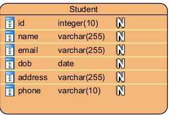
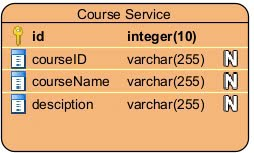
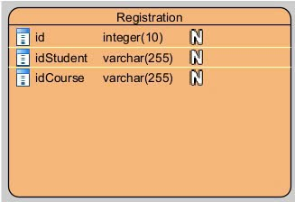

# 📊 Microservices System - Analysis and Design

Tài liệu này trình bày phân tích logic nghiệp vụ và thiết kế hướng dịch vụ cho một quy trình nghiệp vụ cụ thể (use case) trong hệ thống microservices.

*Tài liệu tham khảo*:
1. Service-Oriented Architecture Analysis and Design for Services and Microservices - 2nd Edition
2. Microservices Patterns With examples in Java
3. Bai tap - Phat trien phan mem huong dich vu - Hungdn - 2024
--- 

## 1. 🎯 Problem Statement

Hệ thống giải quyết quy trình nghiệp vụ đăng ký khóa học của sinh viên. Mục tiêu là cho phép sinh viên xem thông tin của họ, duyệt các khóa học có sẵn, đăng ký khóa học và xem các khóa học đã đăng ký thông qua giao diện web đơn giản. Hệ thống được thiết kế dưới dạng tập hợp các microservices để đảm bảo khả năng mở rộng, dễ bảo trì và phân tách rõ ràng các thành phần.

---

## 2. 🧩 Service-Oriented Analysis

- **Main Steps in the Process:**
  1. Người dùng nhập tên sinh viên và lấy thông tin sinh viên.
  2. Người dùng lấy danh sách tất cả các khóa học có sẵn.
  3. Người dùng chọn một khóa học và đăng ký cho nó.
  4. Người dùng lấy danh sách các khóa học đã đăng ký bởi một sinh viên cụ thể.

- **Entities Involved:**
  - Student
  - 

  - Course
  - 
  - Registration
  - 
  
- **Challenges/Requirements Driving Microservices:**
  - Cần mở rộng độc lập logic sinh viên, khóa học và đăng ký.
  - Yêu cầu lưu trữ dữ liệu khác nhau (bộ nhớ đệm cho hiệu suất).
  - Phát triển và triển khai độc lập cho mỗi miền nghiệp vụ.
  - Tích hợp với message broker (Kafka) cho giao tiếp hướng sự kiện và độ tin cậy.
  - API gateway tập trung (Nginx) cho định tuyến và bảo mật.
  - Service discovery (Eureka) cho đăng ký dịch vụ động.
  - Container hóa (Docker) cho triển khai nhất quán.
  - Xác thực và phân quyền tập trung với JWT.
  - Hệ thống thông báo bất đồng bộ cho các sự kiện quan trọng.
  - Giao tiếp giữa các service thông qua REST API với Feign Client.

---

## 3. 🔄 Service-Oriented Design

- **Service Candidates:**
  - **Student Service:** Quản lý dữ liệu sinh viên và cung cấp API để truy xuất thông tin sinh viên.
  - **Course Service:** Quản lý dữ liệu khóa học và cung cấp API để liệt kê và truy xuất chi tiết khóa học.
  - **Register Service:** Xử lý logic đăng ký khóa học, quản lý hồ sơ đăng ký và cung cấp API để đăng ký sinh viên cho khóa học và lấy khóa học đã đăng ký theo sinh viên.
  - **Authentication Service:** Quản lý xác thực người dùng, cấp phát và xác thực JWT tokens.
  - **Notification Service:** Xử lý và gửi thông báo cho người dùng dựa trên các sự kiện từ hệ thống.

- **Service Capabilities:**
  - **Student Service:**
    - Get student by id
    - Create/update student information
  - **Course Service:**
    - Get all courses
    - Get course by ID
    - Create/update course information
  - **Register Service:**
    - Register a student for a course
    - Get all courses registered by a student
  - **Authentication Service:**
    - User registration and login
    - JWT token generation and validation
    - Role-based access control
  - **Notification Service:**
    - Send registration confirmation
    - Send course update notifications
    - Handle notification preferences

- **Interactions:**
  - Frontend (HTML + JavaScript) tương tác với hệ thống thông qua API Gateway (Nginx).
  - API Gateway định tuyến các yêu cầu đến microservice phù hợp.
  - Authentication Service xác thực tất cả các yêu cầu API gửi đến API Gateway.
  - Register Service có thể giao tiếp với Student và Course Services để xác thực sự tồn tại của sinh viên và khóa học trước khi đăng ký.
  - Kafka được sử dụng cho gửi tin nhắn bất đồng bộ 
  - Redis được sử dụng cho bộ nhớ đệm dữ liệu thường xuyên truy cập (danh sách khóa học).
  - Notification Service lắng nghe các sự kiện từ Kafka và gửi thông báo với thông tin gửi qua topic kafka.
  - Các service giao tiếp với nhau thông qua Feign Client:
    - Register Service gọi Student Service để lấy thông tin sinh viên
    - Register Service gọi Course Service để lấy thông tin khóa học

- **Data Ownership:**
  - **Student Service:** Sở hữu dữ liệu sinh viên (lưu trong PostgreSQL).
  - **Course Service:** Sở hữu dữ liệu khóa học (lưu trong PostgreSQL).
  - **Register Service:** Sở hữu dữ liệu đăng ký (lưu trong PostgreSQL).
  - **Authentication Service:** Sở hữu dữ liệu người dùng và tokens (lưu trong PostgreSQL và Redis).
  - **Notification Service:** Sở hữu dữ liệu thông báo và cài đặt thông báo.
  - **Redis:** Được sử dụng cho bộ nhớ đệm (danh sách khóa học).

- **API Specs:**
  - [Student Service API Specs](./api-specs/student-service.yaml)
  - [Course Service API Specs](./api-specs/course-service.yaml)
  - [Registration Service API Specs](./api-specs/registration-service.yaml)
  - [Authentication Service API Specs](./api-specs/authentication-service.yaml)

- **Supporting Technologies:**

| Category | Technology | Purpose |
|----------|------------|----------|
| **Backend Framework** | Spring Boot | Framework chính cho phát triển microservices |
| **API Gateway** | Nginx | Điểm vào duy nhất, định tuyến và bảo mật |
| **Service Registry** | Eureka | Service discovery |
| **Message Broker** | Apache Kafka | Giao tiếp bất đồng bộ và xử lý sự kiện |
| **Database** | PostgreSQL | Lưu trữ dữ liệu chính |
| **Cache** | Redis | Bộ nhớ đệm |
| **Container** | Docker | Container hóa và triển khai |
| **Security** | JWT | Xác thực và phân quyền |
| **Service Communication** | OpenFeign | Giao tiếp giữa các service |
| **Build Tool** | Maven | Quản lý dependencies và build |
| **Version Control** | Git | Quản lý mã nguồn |

---

## Author

This template was created by Hung Dang.
- Email: hungdn@ptit.edu.vn
- GitHub: hungdn1701

Good luck! 💪🚀
