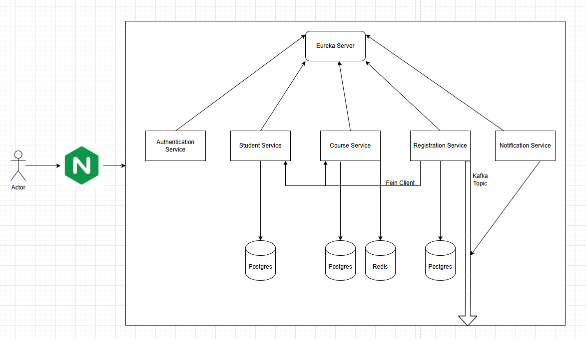

# System Architecture

## Overview
Hệ thống microservices cho phép sinh viên đăng ký khóa học và xem các khóa học đã đăng ký thông qua giao diện web. Kiến trúc được thiết kế để có khả năng mở rộng, dễ bảo trì và phân tách rõ ràng các thành phần, tận dụng các công nghệ hiện đại như Nginx (API Gateway), Kafka (message broker), Redis (cache), Eureka (service registry), Feign (service communication) và Docker (containerization).

## System Components
- 
- **Student Service**: Quản lý dữ liệu sinh viên và cung cấp API để truy xuất thông tin sinh viên.
- **Course Service**: Quản lý dữ liệu khóa học và cung cấp API để liệt kê và truy xuất chi tiết khóa học. Dữ liệu khóa học thường xuyên được truy cập được lưu trong bộ nhớ đệm Redis để tăng hiệu suất.
- **Register Service**: Xử lý logic đăng ký khóa học, quản lý hồ sơ đăng ký và cung cấp API để đăng ký sinh viên cho các khóa học và lấy danh sách khóa học đã đăng ký của sinh viên. Đóng vai trò là bộ điều phối cho các luồng đăng ký và truy vấn.
- **Authentication Service**: Quản lý xác thực người dùng, cấp phát và xác thực JWT tokens. Cung cấp bảo mật tập trung cho toàn bộ hệ thống.
- **Notification Service**: Xử lý và gửi thông báo cho người dùng dựa trên các sự kiện từ hệ thống. Sử dụng Kafka để nhận các sự kiện và gửi thông báo phù hợp.
- **API Gateway (Nginx)**: Đóng vai trò là điểm vào duy nhất cho tất cả các yêu cầu từ client, định tuyến chúng đến các dịch vụ backend phù hợp và cung cấp bảo mật cơ bản và cân bằng tải.
- **Kafka**: Được sử dụng làm message broker cho giao tiếp bất đồng bộ giữa các dịch vụ, đặc biệt là để phát ra các sự kiện đăng ký và thông báo.
- **Redis**: Được sử dụng làm bộ nhớ đệm cho dữ liệu khóa học để cải thiện hiệu suất và giảm tải cho cơ sở dữ liệu.
- **Eureka**: Cung cấp service discovery, cho phép các dịch vụ đăng ký và định vị lẫn nhau một cách động.

## Communication
- **REST APIs**: Frontend giao tiếp với các dịch vụ backend thông qua RESTful APIs được cung cấp thông qua API Gateway (Nginx).
- **Feign Client**: Các dịch vụ giao tiếp với nhau thông qua REST API sử dụng Spring Cloud OpenFeign, cho phép gọi API giữa các dịch vụ một cách dễ dàng và hiệu quả.
- **Message Queues (Kafka)**: Được sử dụng cho giao tiếp bất đồng bộ, thông báo sự kiện đăng ký cho notification service.
- **Internal Networking**: Network Docker được sử dụng cho giao tiếp giữa các dịch vụ nội bộ.

## Data Flow
- **Validate Flow:**
  1. Người dùng nhập nhấp [Validate] trên frontend.
  2. Frontend gửi yêu cầu POST đến API Gateway.
  3. API Gateway định tuyến yêu cầu đến Authentication Service.
  5. Authentication Service xác thực thành công:
    - Authentication Service tạo JWT token
    - Lưu token với thời gian hết hạn
    - Trả về token cho frontend
  6. Nếu xác thực thất bại:
    - Trả về thông báo lỗi cho frontend
  7. Frontend lưu token vào localStorage để sử dụng cho các yêu cầu tiếp theo.

- **View All Courses Flow:**
  1. Frontend gửi yêu cầu GET đến API Gateway.
  2. API Gateway định tuyến yêu cầu đến Course Service.
  3. Course Service kiểm tra cache trong Redis:
    - Nếu có dữ liệu trong cache: trả về dữ liệu từ cache
    - Nếu không có dữ liệu trong cache:
      1. Lấy dữ liệu từ cơ sở dữ liệu PostgreSQL
      2. Lưu dữ liệu vào Redis cache
      3. Trả về dữ liệu cho frontend
  4. Frontend hiển thị danh sách khóa học cho người dùng.

- **Course Registration Flow:**
  1. Người dùng nhấp vào nút "Đăng ký" trên frontend, gửi yêu cầu đăng ký.
  2. Frontend gửi yêu cầu POST đến API Gateway (Nginx).
  4. Nginx chuyển tiếp yêu cầu đến Register Service.
  5. Register Service gọi Student Service và Course Service thông qua Feign Client để xác thực thông tin.
  6. Register Service lưu hồ sơ đăng ký vào cơ sở dữ liệu của nó.
  7. Register Service phát ra sự kiện đăng ký thành công qua Kafka.
  8. Notification Service nhận sự kiện và gửi thông báo xác nhận cho sinh viên.

- **View Registered Courses Flow:**
  1. Người dùng nhấp để xem các khóa học đã đăng ký của một sinh viên.
  2. Frontend gửi yêu cầu đến API Gateway, nơi định tuyến đến Register Service.
  3. Register Service xác thực JWT token thông qua Authentication Service.
  4. Register Service lấy danh sách ID khóa học đã đăng ký của sinh viên từ cơ sở dữ liệu của nó.
  5. Register Service sử dụng Feign Client để gọi Course Service và lấy thông tin chi tiết về các khóa học.
  6. Register Service tổng hợp thông tin và trả về danh sách đầy đủ các khóa học đã đăng ký cho frontend.

[//]: # (## Diagram)

[//]: # (- Một sơ đồ kiến trúc cấp cao nên được đặt trong `docs/asset/` để biểu diễn trực quan các thành phần và tương tác của chúng.)

## Scalability & Fault Tolerance
- Mỗi dịch vụ có thể được mở rộng độc lập dựa trên tải (ví dụ: nhiều phiên bản của Register Service trong thời gian đăng ký cao điểm).
- Bộ nhớ đệm Redis giảm tải cho cơ sở dữ liệu và cải thiện thời gian phản hồi.
- Kafka tách biệt các dịch vụ và cung cấp khả năng phục hồi cho các hoạt động bất đồng bộ.
- Nginx và Eureka cho phép service discovery động, hỗ trợ tính khả dụng cao và failover.

